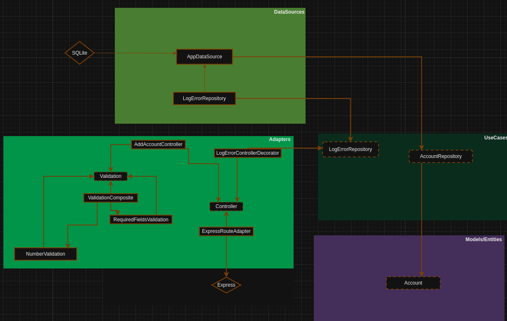

# API de Gerenciamento de Contas

## Visão Geral

Este projeto é uma API de gerenciamento de contas construída com TypeScript, Express, SQLite e TypeORM.

## Índice

- [Recursos](#recursos)
- [Tecnologias](#tecnologias)
- [Arquitetura](#arquitetura)
- [Estrutura das pastas](#estrtutura-das-pastas)
- [Configuração e Instalação](#configuração-e-instalação)
- [Execução](#execução)
- [Uso](#uso)
- [Testes](#testes)
- [Considerações](#considerações)
- [Licença](#licença)

## Recursos

- **Criar Conta**: Crie uma nova conta com um número de conta exclusivo.
- **Obter Saldo da Conta**: Recupere o saldo atual de uma conta.
- **Depositar Fundos**: Deposite fundos em uma conta existente.
- **Transferir Fundos**: Faça uma transferência entre duas contas existentes.

## Tecnologias

### TypeScript

TypeScript é uma linguagem de programação fortemente tipada que se baseia no JavaScript, proporcionando melhor ferramentas em qualquer escala. Utilizei o TypeScript por sua segurança de tipos, que ajuda a detectar erros logo no desenvolvimento, e sua capacidade de escalar com bases de código maiores.

### Express

Express é um framework de aplicação web minimalista e flexível para Node.js que fornece um conjunto robusto de recursos para desenvolver aplicações web e móveis. Utilizei o Express por sua simplicidade e desempenho.

### SQLite

SQLite é uma biblioteca em linguagem C que implementa um mecanismo de banco de dados SQL pequeno, rápido, autônomo, de alta confiabilidade e completo. Utilizei o SQLite por sua simplicidade em criar um banco de dados e que fica salvo no projeto, sendo uma excelente escolha para prototipagem, testes e aplicações de pequena escala.

### TypeORM

TypeORM é um ORM (Object-Relational Mapper) para TypeScript e JavaScript (ES7, ES6, ES5). Ele suporta muitos bancos de dados baseados em SQL. Utilizei o TypeORM para interagir com nosso banco de dados SQLite usando uma abordagem orientada a objetos, o que simplifica a lógica de manipulação de dados. Além disso, escolhemos o TypeORM pela facilidade de manipular queries e, principalmente, pela segurança que ele oferece, abstraindo aspectos como injeção de SQL e proporcionando uma camada adicional de proteção contra vulnerabilidades comuns em bancos de dados.

## Arquitetura

### Arquitetura Limpa

Arquitetura Limpa é uma filosofia de design de software que separa os elementos de um design em níveis de anéis. O objetivo é criar uma estrutura que seja fácil de entender, manter e expandir. Esta arquitetura divide o sistema em camadas, como:

- **Entidades**: Lógica de negócio e entidades centrais.
- **Casos de Uso / Serviços**: Regras de negócio específicas da aplicação.
- **Controladores**: Adaptadores de interface e controladores.
- **Frameworks e Drivers**: BD, UI, APIs externas, etc.

#### A arquitetura criada



### Padrões de projeto

Na arquitetura acima foram usados alguns padrões de projeto pensando na escalabilidade e simplicidade em dar manutenção, esses padrões são:

- Adapter: Se no futuro for necessário alterar a biblioteca de um terceiro, isso será feito de forma simples pois as definições do projeto estão separadas da biblioteca
- Decorator: Com ele é possível adicionar novas funcionalidades, como usado para criar um log de erros, mas sem alterar uma linha do que estava já funcionando
- Factory: Com esse padrão eu isolo as chamadas diretas de construção de objetos em um único lugar. Assim, quando um controller, por exemplo, precisar de mais uma funcionalidade, eu já sei onde ir e adiciono uma linha para mudar.
- Composite: Ao invés de encher o controller de ifs ou ter que injetar cada validação isoladamente, eu crio um agrupador de validações com esse padrão.

## Estrutura das pastas

Essa é a árvore de estrutura das pastas, abaixo há mais detalhes do que cada pasta é:

```
project-root/
├── .github/
├── src/
│ ├── adapters/
│ │ ├──
│ ├── controllers/
│ │ ├── account/
│ │ ├── deposit/
│ │ ├── transfer/
│ │ ├──
│ ├── database/
│ │ ├──
│ ├── decorators/
│ │ ├──
│ ├── docs/
│ │ ├──
│ ├── factories/
│ │ ├── account/
│ │ ├── deposit/
│ │ ├── transfer/
│ │ ├──
│ │ ├──
│ ├── interfaces/
│ │ ├── repositories/
│ │ ├──
│ ├── models/
│ │ ├──
│ ├── repositories/
│ │ ├──
│ ├── routes/
│ │ ├──
│ ├── _tests/
│ │ ├── controllers/
│ │ ├── mocks/
│ │ ├──

│ ├── utils/
│ │ ├── errors
│ │ ├── httpResponses
│ │ ├──
│ ├── validations/
│ │ ├──
│ ├── app.ts
│ └── server.ts
├── .gitignore
├── jest.config.js
├── package-lock.json
├── package.json
├── README.md
├── README[EN].md
└── tsconfig.json
```

### project-root/

A pasta raiz do projeto contém todos os arquivos e pastas necessários para o funcionamento da aplicação e configuração do ambiente.

#### .github/

Estou usando para armazenar a imagem usada nesta documentação.

#### src/

Contém o código-fonte da aplicação.

##### adapters/

Contém adaptadores que fazem a ponte entre diferentes camadas da aplicação.

##### controllers/

Contém os controllers que lidam com as requisições HTTP e chamam os serviços apropriados para manipulação dos dados. Para organizar, separei em **account**, **deposit**, **transfer**

##### database/

Contém a configuração e inicialização do banco de dados.

##### decorators/

Contém decorators usados para adicionar funcionalidades adicionais aos métodos e classes, como logging.

##### docs/

Contém a documentação do projeto, incluindo a documentação da API (`details.pdf`) e um arquivo que pode ser usado em clientes de API REST como Insomnia e Postman (`requests.json`) .

##### factories/

Contém fábricas para instanciar objetos e injetar dependências, facilitando a criação de instâncias para testes e execução. Para organizar, separei em **account**, **deposit**, **transfer**

##### interfaces/

Contém as interfaces TypeScript que definem os contratos usados em diferentes partes da aplicação.

##### models/

Contém os modelos de dados que representam as entidades do sistema e mapeiam para as tabelas do banco de dados.

##### repositories/

Contém os repositórios que são responsáveis por interagir com o banco de dados, realizando operações de CRUD.

##### routes/

Contém a definição das rotas da aplicação, mapeando endpoints para controllers específicos.

##### \_tests/

Contém os testes unitários e de integração para verificar o comportamento correto da aplicação.

###### \_tests/mocks

Simulações de dependências externas, permitindo testes isolados e controlados das funcionalidades da aplicação.

##### utils/

Contém utilitários e helpers usados em diferentes partes da aplicação, como funções de formatação e manipulação de dados.

###### utils/errors

Contém estruturas de erros personalizados para deixar mais claro ao usá-los

###### utils/httpResponses

Contém estruturas de respostas personalizadas para deixar mais claro ao usá-las

##### validations/

Contém as validações usadas para garantir que os dados das requisições estejam no formato esperado e sigam as regras de negócio.

##### app.ts

Arquivo de configuração principal da aplicação, inicializando middlewares, rotas e outras configurações essenciais.

##### server.ts

Arquivo responsável por iniciar o servidor e escutar as requisições nas portas configuradas.

#### .gitignore

Arquivo que especifica quais arquivos e pastas devem ser ignorados pelo Git.

#### jest.config.js

Arquivo de configuração do Jest, o framework de testes usado no projeto.

#### package-lock.json

Arquivo que registra a árvore exata de dependências instaladas no projeto, garantindo que as instalações futuras sejam consistentes.

#### package.json

Arquivo que contém metadados do projeto e lista as dependências e scripts necessários para rodar a aplicação.

#### README.md

Arquivo de documentação em inglês que explica o propósito do projeto, como configurá-lo e usá-lo.

#### README[PT-BR].md

Arquivo de documentação em português que explica o propósito do projeto, como configurá-lo e usá-lo.

#### tsconfig.json

Arquivo de configuração do TypeScript, especificando as opções de compilação do projeto.

## Configuração e Instalação

### Pré-requisitos

- [Node.js](https://nodejs.org/) (>=20.x)

### Instalação

1. Clone o repositório:

   ```bash
   git clone https://github.com/EmersonLaranja/account_management_api.git
   cd account_management_api
   ```

2. Instale as dependências:

   ```bash
   npm install
   ```

## Execução

- Para que a API esteja disponível, execute:

```bash
   npm start
```

- Para rodar os testes, execute:

```bash
   npm test
```

## Uso

Os detalhes de como chamar cada funcionalidade, os parâmetros necessários e mais informações você encontra no arquivo [docs/details](src/docs/details.pdf)

## Testes

Foram feitos testes unitários visando validar se as respostas estão de acordo com o exigido pela documentação. Os testes realizados foram:

### AddAccount Controller

- Deve chamar AddAccount com os valores corretos
- Deve retornar 500 se AddAccount lançar uma exceção
- Deve chamar Validation com o valor correto
- Deve retornar 400 se Validation retornar um erro
- Deve retornar 409 se a conta já existir
- Deve retornar 201 se os dados válidos forem fornecidos

### GetAccountBalance Controller

- Deve retornar 400 se a validação falhar
- Deve chamar getAccount com o número de conta correto
- Deve retornar 404 se a conta não existir
- Deve retornar 200 com o saldo da conta se a conta existir
- Deve retornar 500 se accountRepository lançar uma exceção

### DepositIntoAccount Controller

- Deve retornar 400 se a validação falhar
- Deve chamar getAccount com o número de conta correto
- Deve retornar 404 se a conta não existir
- Deve chamar depositIntoAccount com os valores corretos
- Deve retornar 200 ao depositar
- Deve retornar 500 se accountRepository lançar uma exceção

### MakeAccountTransfer Controller

- Deve retornar 400 se a validação falhar
- Deve chamar makeTransfer com os valores corretos
- Deve retornar 200 com os dados corretos em caso de transferência bem-sucedida
- Deve retornar 500 se transferRepository lançar uma exceção
- Deve retornar 409 se InsufficientError for lançada

## Considerações

- Por se tratar de simplicidade e eu estou fazendo um trabalho solo, optei por não usar nenhuma configuração de linting.
- Pelo mesmo motivo, não vou forçar subir para o commit apenas testes que passem.
- Tomei a decisão de considerar o Balance como um campo ao invés de uma entidade.
- Com isso toda conta ao ser criada, possui o saldo inicial de 0.
- Foi pedido que o projeto fosse feito pensando em ser simples. Com isso me dediquei para deixar o mais simples de se dar manutenção, de escalar, de testar.

## Licença

Este projeto é licenciado sob a Licença MIT. Veja o arquivo [LICENSE](LICENSE.md) para mais detalhes.
